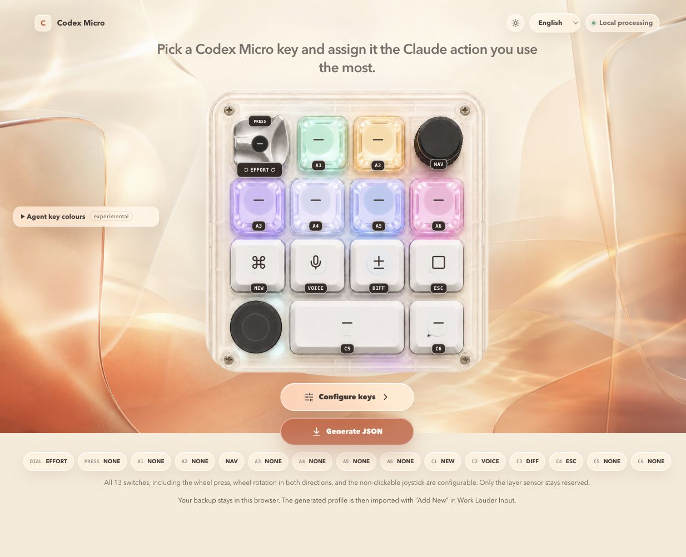
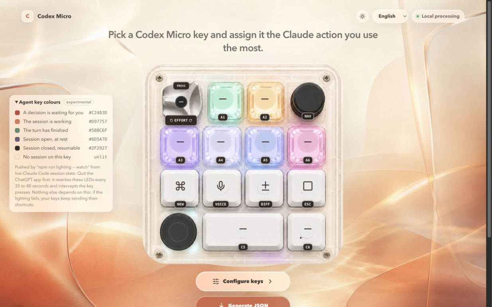
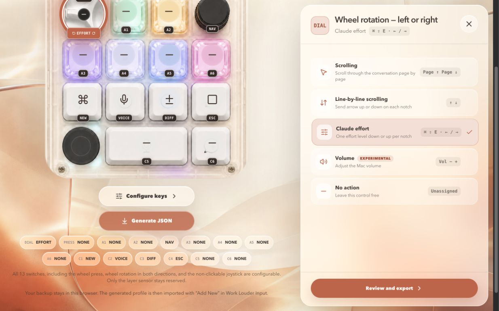
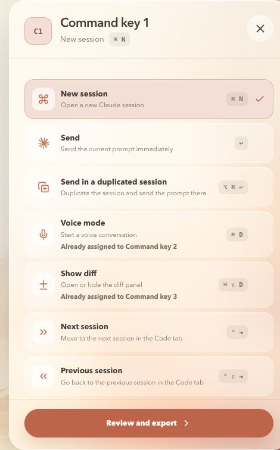
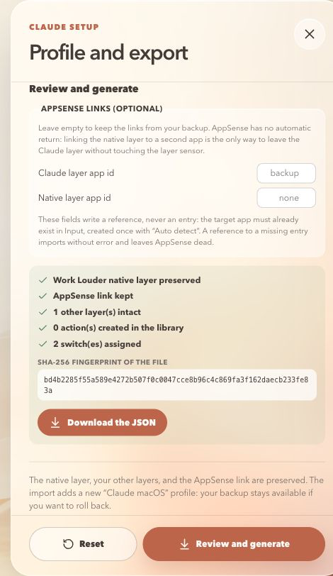

<h1 align="center">Codex Micro × Claude</h1>

<p align="center">
  <strong>A safe, local configurator for mapping Work Louder Codex Micro controls to Claude Desktop and Claude Code.</strong>
</p>

<p align="center">
  
  
  
  
</p>



## Latest additions

- six Agent keys can now mirror live Claude Code session state by colour and
  open the selected session;
- navigation covers identifiable terminal sessions and, experimentally,
  sessions hosted by Claude Desktop or an IDE;
- the configurator now includes a calibrated effort wheel, eight-direction
  joystick actions, AppSense controls, and a mobile-friendly layout.

| Live Claude Code session colours | Calibrated effort wheel |
| :---: | :---: |
|  |  |
| See which session needs you, is working, has finished, or can be resumed. | Move one Claude effort level up or down with each wheel notch. |

## Map Claude to your fingertips

This project turns a real Work Louder Input profile into a dedicated
`Claude macOS` profile—without uploading the backup or overwriting the native
Codex layer.

**Current mapping:** `K1 ⌘N` new session · `K2 ⌘D` voice · `K3 ⌘⇧D` diff ·
`K4 Esc` stop · dial to adjust Claude effort · joystick to navigate.

| Expanded action catalog | AppSense safety review |
| :---: | :---: |
|  |  |
| Add session navigation, voice, diff, search, window actions, or a safe custom shortcut. | Verify the native layer, AppSense link, other layers, and SHA-256 fingerprint before downloading. |

> [!IMPORTANT]
> This is an actively developed community project. The local configurator and
> profile generator work with the documented fixtures and Input `0.17.3`
> profile flow, but the official `*-layer.json` round-trip and full hardware
> checklist are still in progress.

## What works today

- guided key-editing and profile-export modes with English, French, Spanish,
  and German interfaces;
- visual mapping for all 13 switches, wheel rotation, and the joystick;
- expanded Claude Desktop catalog for sessions, voice, diff, search,
  navigation, settings, window controls, zoom, and two explicit send actions;
- default wheel mode that moves through Claude's available effort levels one
  notch at a time, calibrated at roughly 90 ms per notch;
- safe custom shortcuts with Return/Enter, Delete, and Backspace rejected by
  construction;
- preservation checks for the native layer, other layers, and AppSense link;
- local JSON generation with a SHA-256 fingerprint and no upload.

## Run it locally

```sh
git clone https://github.com/thannous/claude-codex-micro.git
cd claude-codex-micro
npm run configure
```

Node.js 18 or newer is required. The app binds only to `127.0.0.1`.

## Agent key lighting — experimental

Everything above is the project. This part is an experiment on top of it: the
six Agent keys show the live state of your Claude Code sessions in colour, and
pressing one goes to that session.

| | | |
| --- | --- | --- |
| `#C2483D` | **a decision is waiting for you** | the only colour that asks for you |
| `#D97757` | the session is working | |
| `#5B8C6F` | the turn has finished | |
| `#6D5A7D` | session open, at rest | |
| `#2F2927` | session closed, resumable | |
| unlit | no session on this key | |

**It only runs under three conditions.**

1. **Quit the ChatGPT app.** It rewrites these LEDs every 35 to 40 seconds and
   intercepts Agent key presses. Last write wins, so with it running you will
   see your colours appear and then vanish.
2. `npm install`, so that `node-hid` — an optional dependency — is built.
3. The Agent keycodes have to sit on the Claude layer. Input does not offer
   them in its key picker, so `scripts/enable-agent-keys.mjs` writes a profile
   for you to import through **Input > Import Profile**.

**If this half breaks, the other half does not.** Nothing above depends on it.
When the ChatGPT app takes the LEDs back, when `node-hid` is absent, or when an
app update moves the resume route, your keys keep sending their shortcuts. The
lighting writes nothing persistent either — only volatile HID reports, so no
firmware, no Input storage, and no ChatGPT app state is touched.

```sh
node scripts/thread-status.mjs watch    # reconcile sessions, write slots.json
node scripts/lighting.mjs watch --hold  # push those colours onto the keys
```

`thread-status` reconciles two official sources — `claude agents --json` for
live sessions, and a plugin hook journal for their state — into
`~/.claude/thread-status/slots.json`. `lighting watch` follows that file.
`--hold` reapplies as soon as a foreign write is detected.

```console
$ node scripts/thread-status.mjs doctor
  ✔ claude binary: $HOME/Library/Application Support/Claude/…/claude
  ✔ claude agents --json: 6 live session(s)
  ✔ state directory reachable: $HOME/.claude/thread-status
  ✔ journal: 194 event(s), last UserPromptSubmit 513s ago
  ✔ navigation: 4/6 session(s) in an identifiable terminal — the others are
    hosted by Claude Desktop or an IDE, reached through claude://resume
```

Pressing an Agent key navigates to its session: a terminal session gets its
window focused over AppleScript, and a session hosted by Claude Desktop is
opened through `claude://resume?session=<uuid>`. That route is **not
documented** — it is verified on this machine and can change with an app
update. The URL handler also reports nothing back, so a session whose
transcript has left the disk fails silently on the app side.

The per-key lighting channel is confirmed on hardware and reimplemented in
original code from the observed format. No Work Louder SDK is redistributed.
Protocol, measurements and limits:
[`docs/research/hid-lighting-protocol.md`](docs/research/hid-lighting-protocol.md)
and [`docs/research/thread-status-feasibility.md`](docs/research/thread-status-feasibility.md).

> Independent community project, not affiliated with or endorsed by Work
> Louder or Anthropic. Product names and trademarks belong to their respective
> owners.

---

## Documentation détaillée

### Vision

Une personne doit pouvoir :

1. comprendre le mapping avant de toucher au clavier ;
2. vérifier sa compatibilité ;
3. sauvegarder la configuration Input existante ;
4. simuler le changement ;
5. transformer uniquement le layer `Claude` existant dans une copie locale ;
6. tester AppSense et chaque contrôle ;
7. restaurer l'état précédent ;
8. contribuer un autre preset avec le même niveau d'exigence.

À terme, le catalogue pourra accueillir des layers IDE, navigateur, recherche,
Figma, Framer, applications Adobe et workflows communautaires. Lire la
[vision](docs/vision.md) et la [feuille de route](docs/roadmap.md).

### Résultat V1 actuel

Le dépôt contient désormais :

- un manifeste portable V1 et des schémas réutilisables ;
- un mapping physique Claude avec couleur, cadran, joystick et AppSense ;
- une représentation SVG originale du Codex Micro ;
- un configurateur graphique local lancé par `npm run configure` ;
- un outil Node.js de diagnostic, inventaire, sauvegarde, dry-run, sanitation et
  rollback ;
- un générateur local de profile Input `0.17.3` qui préserve le layer natif et
  le lien AppSense existant ;
- des tests transactionnels sur copies isolées ;
- une analyse reproductible du mécanisme de partage d'Input `0.17.2` ;
- une procédure permettant de capturer ensuite le véritable export officiel.

L'analyse du package officiel confirme des commandes **Import layer** et
**Export layer**, des fichiers `*-layer.json`, ainsi que l'enveloppe JSON
attendue. Le vrai fichier Claude n'est volontairement pas fabriqué : ses objets
internes doivent provenir d'un export réel du Codex Micro.

Le manifeste V1 est `hardware-observed` : le générateur a été validé sur un
export Input `0.17.3`, mais le round-trip d'un artefact `*-layer.json` et la
checklist matérielle complète restent ouverts. Le fichier logique
`macos.example.json` reste séparément `proposal-not-applied` : ce n'est pas un
preset universel à importer.

### Mapping Claude proposé

Le layer natif Codex situé à l'index `0` est protégé. Le profile source doit
contenir exactement un layer `Claude`, différent de l'index `0` et déjà lié à
Claude Desktop avec AppSense.

| Contrôle | Action |
| --- | --- |
| rangée des quatre touches carrées, gauche | `⌘N` — nouvelle conversation |
| même rangée, deuxième | `⌘D` — mode vocal |
| même rangée, troisième | `⌘⇧D` — afficher ou masquer le diff |
| même rangée, droite | `Esc` — annuler ou fermer selon le contexte |
| molette cliquable, coin supérieur gauche | `PageUp` / `PageDown` ; clic configurable |
| joystick sans clic, coin supérieur droit | quatre flèches directionnelles |
| autres contrôles | aucune action ; capteur de layer réservé |

Couleur proposée : `#D97757`. Activation : Claude Desktop au premier plan via
AppSense et `Auto detect`.


Les raccourcis globaux de Claude restent hors du layer AppSense : double appui
sur Option pour la saisie rapide et Verr. Maj. pour la dictée globale. Ils
doivent rester disponibles quand une autre application est au premier plan.

### Ce qui est interdit par défaut

- Retour/Entrée et envoi de message ;
- approbation ou refus de permission ;
- suppression ;
- `git push` ;
- déploiement ;
- commande shell ou action destructive.

Les validateurs échouent si l'une de ces actions apparaît dans un contrôle
actif.

### Compatibilité observée

- macOS `26.5.2` arm64 ;
- Work Louder Input `0.17.3` pour le générateur de profile ;
- firmware Codex Micro `v0.4.1` ;
- Claude Desktop `1.24012.9` ;
- bundle Claude `com.anthropic.claudefordesktop` ;
- bundle Input `it.focusense.input-app`.

Voir la [matrice de compatibilité](docs/compatibility.md) pour distinguer les
faits, tests de fixture et validations matérielles manquantes.

### Configurateur graphique

```sh
npm run configure
```

La première ouverture peut installer les dépendances verrouillées du GUI, puis
lance l'interface uniquement sur `127.0.0.1` et ouvre le navigateur.

L'interface est disponible en anglais (langue par défaut), français, espagnol
et allemand. Le choix de langue est mémorisé localement dans le navigateur.

Le parcours est un assistant en trois étapes : charger l'export officiel Work
Louder Input (avec aide intégrée pour créer le layer `Claude` et le lien
AppSense), personnaliser les contrôles, puis vérifier et générer. L'écran de
vérification affiche les garanties de préservation (layer natif, AppSense,
autres layers) et l'empreinte SHA-256 du `Claude-macOS-profile.json` produit.
Le fichier source, le layer natif, les autres layers et les autres liens
AppSense sont conservés. Le JSON logique public n'est jamais présenté comme
directement importable.

Le configurateur relit le mapping déjà présent dans le layer Claude chargé,
mémorise localement la configuration en cours, suit le thème clair ou sombre
du système et propose :

- les 13 switches physiques, y compris l'appui de la molette, ainsi que sa
  rotation et le joystick ; seul le capteur tactile de changement de layer
  reste réservé ;
- un catalogue étendu de raccourcis Claude Desktop : session, voix, diff,
  recherche, navigation, réglages, fenêtre, zoom et deux actions d'envoi
  explicites ;
- des raccourcis personnalisés restreints aux touches sûres (Retour/Entrée,
  Suppression et Retour arrière restent interdits dans l'éditeur
  personnalisé) ;
- quatre modes de molette : effort Claude par défaut, pages, lignes, et volume
  expérimental.

### Démarrage sans modification

Prérequis : Node.js 18 ou version ultérieure. Les dépendances de validation
sont verrouillées dans `package-lock.json`.

```sh
git clone https://github.com/thannous/claude-codex-micro.git
cd claude-codex-micro
npm ci --no-audit --no-fund
npm run check
node scripts/input-layer.mjs doctor --json
node scripts/input-layer.mjs install --dry-run --json
```

La dernière commande reste bloquée sans inventaire local contenant exactement
un layer `Claude`, ce qui est volontaire.

### Installation sûre

Le parcours réel commence par un export officiel de profile et une sauvegarde
vérifiée :

```sh
node scripts/input-layer.mjs backup \
  --profile-export "$HOME/Downloads/Mac-profile.json" \
  --json

node scripts/input-layer.mjs inventory \
  --profile-export "$HOME/Downloads/Mac-profile.json" \
  --output .local/inventories/current.json \
  --json

node scripts/input-layer.mjs install \
  --inventory .local/inventories/current.json \
  --profile-export "$HOME/Downloads/Mac-profile.json" \
  --dry-run \
  --json

npm run build:profile -- \
  "$HOME/Downloads/Mac-profile.json" \
  "$HOME/Downloads/Claude-macOS-profile.json"
```

Importer ensuite `Claude-macOS-profile.json` avec **Add New** dans Input. Le
fichier source reste inchangé et aucune donnée n'est téléversée.

Lire le [guide d'installation et de retour arrière](docs/installation.md) avant
`--apply`.

### Format de partage

Input `0.17.2` expose un flux officiel au niveau layer et profile :

- `*-layer.json` : `keyboard`, `language`, `layer`, actions et groupes ;
- `*-profile.json` : même enveloppe avec `profile`.

La preuve et ses limites sont documentées dans
[`docs/research/input-0.17.2-sharing.md`](docs/research/input-0.17.2-sharing.md).

Le manifeste communautaire n'imite pas ce format. Le parcours principal
transforme localement un vrai `*-profile.json`. Un éventuel artefact layer
public restera optionnel et devra être lié à son SHA-256, au mapping canonique
et à une preuve de round-trip.

### Structure

```text
profiles/
  schema/v1/                schémas réutilisables
  claude-shortcuts/
    manifest.json           identité, preuve et installation
    mapping.json            mapping physique et sécurité
    assets/layout.svg       aperçu original
    artifacts/              futur export officiel assaini
scripts/
  configure.mjs             lancement local du configurateur graphique
  prepare-gui.mjs           préparation verrouillée des dépendances du GUI
  build-input-profile.mjs   génération locale du profile importable
  input-layer.mjs           diagnostic, sauvegarde et installation guidée
  thread-status.mjs         compagnon des six touches Agent (états des sessions)
  lighting.mjs              pilotage de l'éclairage : probe/set/watch/listen/off
  lib/                      fonctions de validation, de preset et le canal HID
  validate-profile.mjs      contrat logique Claude historique
  validate-presets.mjs      invariants de la bibliothèque
prototype/
  src/                      interface locale du configurateur
shared/
  input-profile.mjs         transformation canonique partagée avec le GUI
tests/
  input-layer.test.mjs      sauvegarde, rollback, sanitation et idempotence
docs/
  installation.md           procédure complète
  compatibility.md          matrice de preuve
  research/                 analyse Input assainie
ble/                        piste Hardware Buddy séparée
```

Les sauvegardes, inventaires et sessions sont stockés sous `.local/`, ignoré
par Git. `work/` et `outputs/` restent également locaux.

### Validation

```sh
npm run check
node scripts/check-doc-links.mjs
git diff --check
```

La CI exécute les mêmes contrôles. Les tests isolés prouvent le comportement de
l'outil, pas celui d'Input ou du clavier réel.

### Piste BLE Hardware Buddy

Cette piste reste indépendante. La présence du Codex Micro en BLE HID ne prouve
ni le Nordic UART Service, ni la coexistence HID + NUS, ni un firmware
modifiable. Aucun firmware, outil de flash ou approbation automatique n'est
publié.

Lire [`ble/README.md`](ble/README.md) et
[`ble/feasibility.md`](ble/feasibility.md).

### Pilotage de l'éclairage des touches

Voir [Agent key lighting — experimental](#agent-key-lighting--experimental),
plus haut : conditions, garantie d'isolation et commandes y sont réunies. Les
commandes et leur sortie sont en anglais, comme tout le reste de l'outillage.

Le jeu complet des sous-commandes :

```sh
node scripts/lighting.mjs probe              # canal et mapping des touches
node scripts/lighting.mjs set slot 3 '#C2483D' --effect=breath
node scripts/lighting.mjs set all '#D97757'
node scripts/lighting.mjs zones --keys=#D97757 --ambient=#6D5A7D
node scripts/lighting.mjs listen             # événements touches et joystick
node scripts/lighting.mjs off
```

Protocole, mesures et bornes :
[`docs/research/hid-lighting-protocol.md`](docs/research/hid-lighting-protocol.md).

### Liens de documentation

- [Vision](docs/vision.md)
- [Feuille de route](docs/roadmap.md)
- [Installation et rollback](docs/installation.md)
- [Compatibilité](docs/compatibility.md)
- [Mécanisme Input 0.17.2](docs/research/input-0.17.2-sharing.md)
- [Protocole d'éclairage HID du Codex Micro](docs/research/hid-lighting-protocol.md)
- [Conventions des presets](profiles/README.md)
- [Preset Claude](profiles/claude-shortcuts/README.md)
- [Contribution](CONTRIBUTING.md)
- [Sécurité](SECURITY.md)

### Sources principales

- [Work Louder — configuration officielle du Codex Micro](https://worklouder.cc/openai-micro-setup)
- [Work Louder — releases Input](https://github.com/worklouder/input-releases/releases)
- [Claude — saisie rapide sur macOS](https://support.claude.com/en/articles/12626668-use-quick-entry-with-claude-desktop-on-mac)
- [Claude — ouvrir l'application avec un lien](https://support.claude.com/en/articles/14729294-open-claude-desktop-with-a-link)

### Licence

MIT, copyright 2026 Thanh Chau. Voir [LICENSE](LICENSE) et
[LICENSING.md](LICENSING.md).
