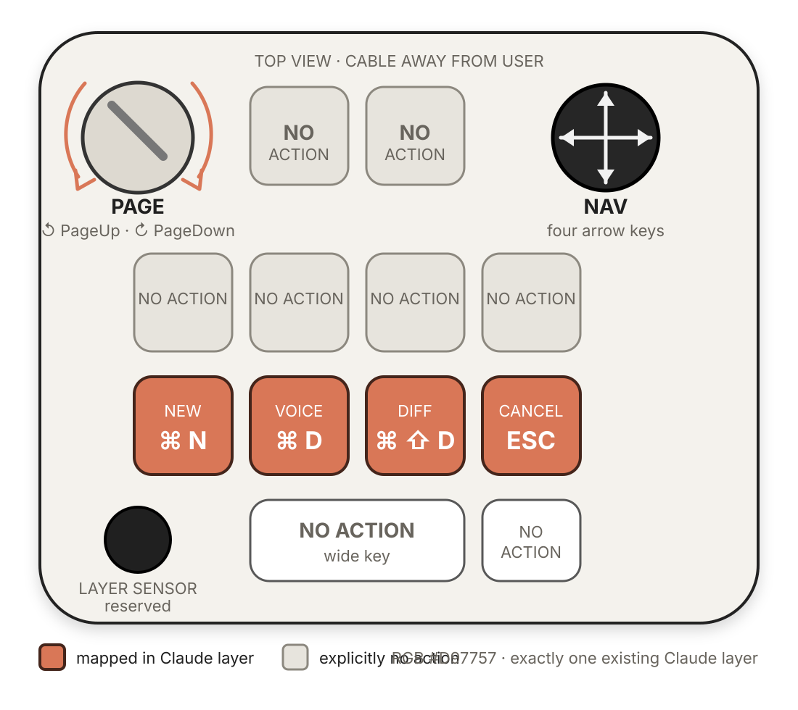

# Configurer le Codex Micro pour Claude Desktop

## Flux cible

1. exporter le profile Input actif et créer une sauvegarde vérifiée ;
2. inventorier les layers sans publier les données privées ;
3. protéger intégralement le layer natif à l'index `0` ;
4. exiger exactement un layer `Claude` existant, hors index `0` ;
5. conserver son lien AppSense dans une copie locale du profile ;
6. appliquer le mapping physique documenté à cette copie ;
7. tester chaque contrôle, la perte de focus et le redémarrage ;
8. exporter le layer, l'assainir et vérifier son round-trip ;
9. restaurer le profile original en cas d'écart.

Cette intégration utilise les raccourcis HID et AppSense. Elle ne dépend pas du
protocole expérimental Hardware Buddy.

Le manifeste et le mapping V1 décrivent l'état observé du générateur. Le fichier
logique `macos.example.json` reste `proposal-not-applied` et ne doit pas être
importé tel quel. `npm run configure` fabrique uniquement un profile personnel
à partir de l'export officiel de l'utilisateur.

## Préservation obligatoire

Le preset et l'outil imposent les règles suivantes :

- index `0` protégé, sans remplacement ni modification ;
- politique `exactly-one-existing-named-layer` ;
- six emplacements au maximum ;
- aucun autre profile, layer ou lien AppSense modifié ;
- absence ou doublon `Claude` refusé ;
- structure d'export inconnue refusée au lieu d'être interprétée ;
- sauvegarde et vérification SHA-256 avant la session réelle ;
- aucune écriture directe dans le stockage Input ou le périphérique.

L'inventaire bloque la transformation si l'export officiel ne permet pas de
prouver la présence du layer protégé à l'index `0` et d'un unique layer
`Claude`.

## Mapping physique V1

Orientation : vue du dessus, câble à l'opposé de l'utilisateur.

| Contrôle | Position | Action |
| --- | --- | --- |
| Touche 1 | rangée des quatre touches carrées, tout à gauche | `⌘N` — nouvelle conversation |
| Touche 2 | même rangée, deuxième | `⌘D` — mode vocal |
| Touche 3 | même rangée, troisième | `⌘⇧D` — afficher ou masquer le diff |
| Touche 4 | même rangée, tout à droite | `Esc` — annuler ou fermer selon le contexte |
| Cadran | coin supérieur droit | horaire : `PageDown` ; antihoraire : `PageUp` |
| Joystick | coin supérieur gauche | flèches haut, droite, bas et gauche |



Les identifiants internes `inputControlId` restent `null` jusqu'à leur relevé
dans Input sur le Codex Micro exact. Les positions ci-dessus sont donc une cible
physique lisible, pas une affirmation sur le schéma interne de l'application.

## Apparence

- nom du layer : `Claude` ;
- couleur proposée : `#D97757` ;
- autres contrôles : `no-action` ;
- capteur tactile : réservé au changement de layer ;
- appui du cadran : aucune action.

## AppSense

Le lien cible uniquement :

```text
Claude
com.anthropic.claudefordesktop
```

Le lien doit exister avant l'export du profile. Le générateur conserve son
`linkedAppId` dans la copie locale, refuse son absence et ne crée jamais un
second lien. Les autres liens ne sont jamais modifiés.

Le retour à un état sûr après perte de focus reste une validation matérielle
obligatoire : il ne doit pas être supposé à partir de la seule documentation.

## Actions absentes par défaut

- Retour/Entrée et envoi d'un message ;
- approbation, refus ou rejet d'une permission ;
- suppression ;
- `git push` ;
- déploiement ;
- terminal, shell ou commande destructive ;
- raccourcis globaux Saisie rapide et Dictée.

Les raccourcis globaux sont volontairement hors du layer AppSense : ils doivent
rester utilisables quand une autre application est au premier plan. Sur la
configuration documentée, il s'agit du double appui sur Option pour la saisie
rapide et de Verr. Maj. pour la dictée globale.

## Partage officiel observé

Input `0.17.2` contient les flux **Export layer**, **Import layer**, **Export
Profile** et **Import Profile**. Un export de layer porte le suffixe
`*-layer.json` et contient l'enveloppe décrite dans
[`docs/research/input-0.17.2-sharing.md`](../research/input-0.17.2-sharing.md).

Le dépôt ne fabrique pas les objets internes `layer`, `actions` et groupes. Le
futur artefact doit provenir d'un vrai export du Codex Micro, être assaini, puis
réimporté sur une configuration isolée.

## Validation restante

- [ ] export du profile réel et inventaire lisible ;
- [ ] positions et identifiants physiques vérifiés dans Input ;
- [x] transformation locale du layer existant sans modification de l'index `0` ;
- [x] conservation du lien AppSense dans le profile généré ;
- [ ] quatre touches, cadran et joystick testés ;
- [ ] contrôles inutilisés confirmés sans action ;
- [ ] état sûr après perte de focus ;
- [ ] persistance après redémarrage ;
- [ ] export/import du layer reproduit sur une copie isolée ;
- [ ] doublon refusé ou traité idempotemment ;
- [ ] profile original réimporté et périphérique vérifié.

## Sources

- [Work Louder — Codex Micro, layers et AppSense](https://worklouder.cc/openai-micro-setup)
- [Claude — saisie rapide sur macOS](https://support.claude.com/en/articles/12626668-use-quick-entry-with-claude-desktop-on-mac)
